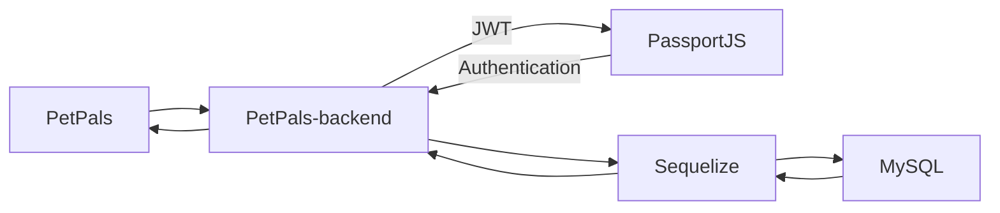

# PetPals-backend

## 📘 Description

A Group Final-Project in CodeCamp 2019.

## 📦 Built With

- [Express](https://expressjs.com/) - A Web Application Framework
- [Passport](http://www.passportjs.org/docs/) - An Authentication Middleware for NodeJS
- [Sequelize](https://sequelize.org/) - An ORM Library for MySQL
- [MySQL2](https://www.npmjs.com/package/mysql2) - A Library for NodeJS to Connecting a MySQL DB

## 🛠 Structure




## 📋 Features

- APIs CRUD for
  - bankService
  - feedbackService
  - guideTextService
  - orderService
  - serviceService
  - storeService
  - userService
  - storeImageService
  - addressService
  - paymentMethodService

## 🏷 Versioning

- Current Version: 0.1.2
- For the versions available, see the [tags on this repository.](https://github.com/PetPals-CC4/petpals-backend/tags)

## 💡 Getting Started

1️⃣ Clone this project by

  ```bash
    git clone https://github.com/PetPals-CC4/petpals-backend.git
  ```

2️⃣ Run Commands

  ```bash
    npm install # or just `yarn`

    npm start # or just `yarn start`

    # Default link: http://localhost:3000/
  ```

3️⃣ Add `config.json` in `./config/config.json` for more detail, next topic.

4️⃣ Run Commands

  ```bash
    npx sequelize db:create
    npm start

    # If you want some mock data please run `npm seed` after run `npm start`
  ```

5️⃣ Enjoy with :D

## ⚙️ Configurations

Create a config.json `./config/config.json` with this detail, edit your password and database name

```json
  {
    "development": {
      "username": "root",
      "password": "{{REPLACE_YOUR_PASSWORD}}",
      "database": "petpals",
      "host": "127.0.0.1",
      "dialect": "mysql",
      "operatorsAliases": 0,
      "protocol": "http",
      "port": 3306,
      "app_port": 5000,
      "timezone": "Asia/Bangkok"
    },
    "test": {
      "username": "root",
      "password": null,
      "database": "database_test",
      "host": "127.0.0.1",
      "dialect": "mysql",
      "operatorsAliases": 0,
      "protocol": "http",
      "port": 3306,
      "app_port": 5000,
      "timezone": "Asia/Bangkok"
    },
    "production": {
      "username": "root",
      "password": null,
      "database": "database_production",
      "host": "127.0.0.1",
      "dialect": "mysql",
      "operatorsAliases": 0,
      "protocol": "http",
      "port": 3306,
      "app_port": 5000,
      "timezone": "Asia/Bangkok"
    }
  }
```

## Example APIs

Please go to Postman Collection [PetPals-backend.postman_collection.json](PetPals-backend.postman_collection.json)

## 😎 Author

PetPals Team - Codecamp 4 (2019)

## 🚩 Created at

13 Jan 2020
